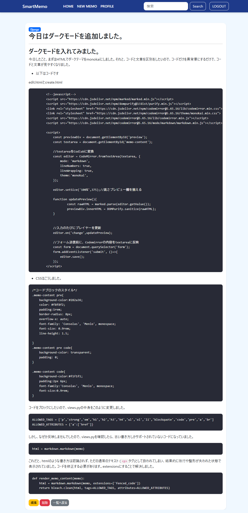

# SmartMemo Ver6.0

### Where Notes Meet Code.

開発期間：2026年6月中旬～継続開発中

> A hybrid note-taking application that combines Markdown, mathematical 
> expressions, and executable Python code in one workspace.
> Markdown・数式・Pythonコードを1つのワークスペースで扱えるハイブリッドメモアプリです。

【アプリのスクリーンショット】

- ダークテーマ対応

## Ver6.0 更新内容
- Markdown記法によるメモ作成・編集に対応（Markdown support for creating/editing memos）
- 🆕KaTeXによる数式表示に対応（KaTeX support for mathematical expressions）
- 🆕Pyodideを利用したブラウザ上でのPythonコード実行機能を追加（Added browser-based Python execution using Pyodide）
- 🆕Python実行結果をMarkdownノート内へ保存できるよう改善（Python execution results can be saved directly into Markdown notes）
- CodeMirrorエディタを導入し、行番号・シンタックスハイライト付きの入力欄に（Integrated CodeMirror editor with line numbers and syntax highlighting）
- marked.js + DOMPurifyでリアルタイムMarkdownプレビューを実装（XSS対策込み）（Real-time Markdown preview with XSS sanitization）
- markdown + bleachでサーバー側でも安全にMarkdownをHTML変換し一覧・詳細画面に反映（Server-side Markdown rendering with sanitization）
- メモ詳細画面を新規追加し、一覧画面をタイトル+更新日時のシンプル表示に変更（Added memo detail page; simplified list view）
- CodeMirrorをmonokaiテーマに変更しダークモード化、コードブロックの表示もダークスタイルに統一（Dark theme for editor and code blocks）
- Memoモデルにcreated_at / updated_atフィールドを追加（Added created_at/updated_at fields to Memo model）

## Features(主な機能)
- ユーザー登録（Sign Up）
- ログイン / ログアウト（Login / Logout）
- パスワードリセット（Password Reset）
- パスワード変更（Password Change）
- プロフィール表示・編集（Profile Management）
- プロフィール画像アップロード（Profile Image Upload）
- メモの作成・編集・削除（Create / Edit / Delete）
- メモ検索（Search）
- カテゴリ管理（Categories）
- アカウント削除（Account Deletion）
- Markdown対応メモ作成・編集（Markdown-based memo creation/editing）
- コードエディタ（CodeMirror、シンタックスハイライト付き）
- メモ詳細画面（Memo detail page）
- 🆕KaTeX数式表示（KaTeX Math Rendering）
- 🆕Pythonコード実行（Browser-based Python Execution）
- 🆕Python実行結果のノート保存（Save Python Execution Results）

## Technical Highlights(開発内容)
- Django標準認証フォームをカスタマイズ（Customized Django authentication forms）
- Bootstrap対応のフォームデザインを実装（Bootstrap-styled forms）
- OneToOneFieldを利用したプロフィール管理（Profile model with OneToOneField）
- ImageFieldを利用したプロフィール画像アップロード機能（Image upload using ImageField）
- Gmail SMTPを利用したパスワードリセットメール送信（Password reset via Gmail SMTP）
-  Django標準バリデーションメッセージの日本語化（Japanese localization of Django validation messages）
- UUIDによるアップロード画像ファイル名の自動生成（Automatic UUID-based filename generation for uploaded images）
- Django Signalsを利用したプロフィール自動作成（Automatic profile creation using Django Signals）
- marked.js + DOMPurifyによるXSS対策済みMarkdownプレビュー
- Python markdownライブラリ + bleachによるサーバーサイドのMarkdownサニタイズ
- CodeMirrorエディタの導入とMonokaiテーマ適用
- 🆕CodeMirrorを利用したMarkdownコードエディタ
- 🆕marked.js + DOMPurifyによるリアルタイムMarkdownプレビュー
- 🆕KaTeXによる数式レンダリング
- 🆕Pyodideによるブラウザ内Python実行環境
- 🆕Python実行結果をMarkdownへ自動反映するノート機能
- 🆕JavaScriptの共通モジュール化（markdown_editor.js / markdown_viewer.js）

## Tech Stack
- Python
- Django
- Bootstrap 5
- CSS
- SQLite 
- Git
- GitHub

## Future Plans
- Overleaf-style resizable editor and preview
- Multi-language code execution
- PostgreSQL migration
- Responsive UI improvements
- Email verification

## Version History
- Ver1.0 CRUD
- Ver2.0 Search & Categories
- Ver3.0 Authentication
- Ver4.0 Profile / Password Change / Account Deletion
- Ver5.0 Profile Image Upload & Password Reset
- Ver6.0 Markdown, KaTeX & Python Execution

## 開発メモ
SmartMemoは、Djangoの学習とWebアプリケーション開発の理解を目的として開発しています。
現在も継続的に機能追加・改善を行い、バージョンアップを続けています。
将来的には、通常のメモだけでなく、コードも保存・管理できるメモアプリへ発展させる予定です。

  
